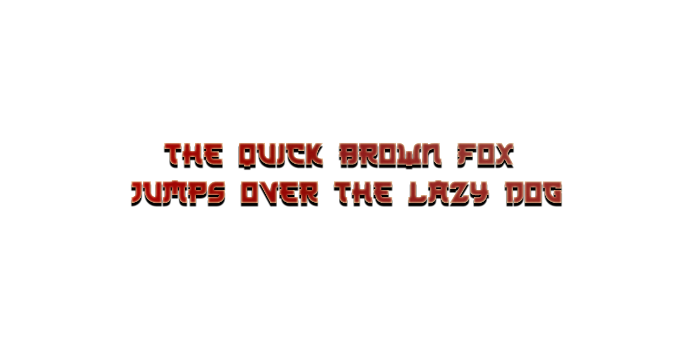

# Duck

Duck is a waterbird with a broad blunt bill, short legs, webbed feet, and a waddling gait.

## Variable Font Axe

Duck has the following axe:

  Tag | Default | Static Instances
--- | --- | ---
  wght | 400 | Regular

## License
This Font Software is licensed under the SIL Open Font License, Version 1.1.
This license is available with a FAQ at [https://openfontlicense.org](https://openfontlicense.org)
